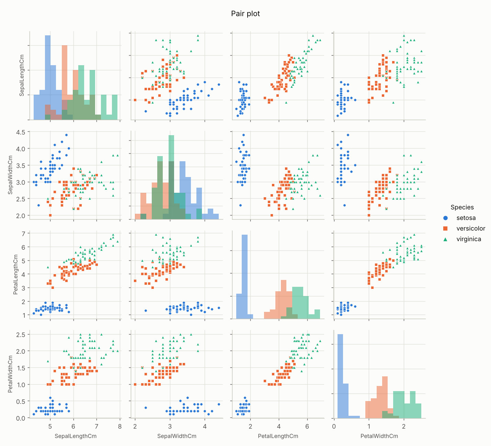
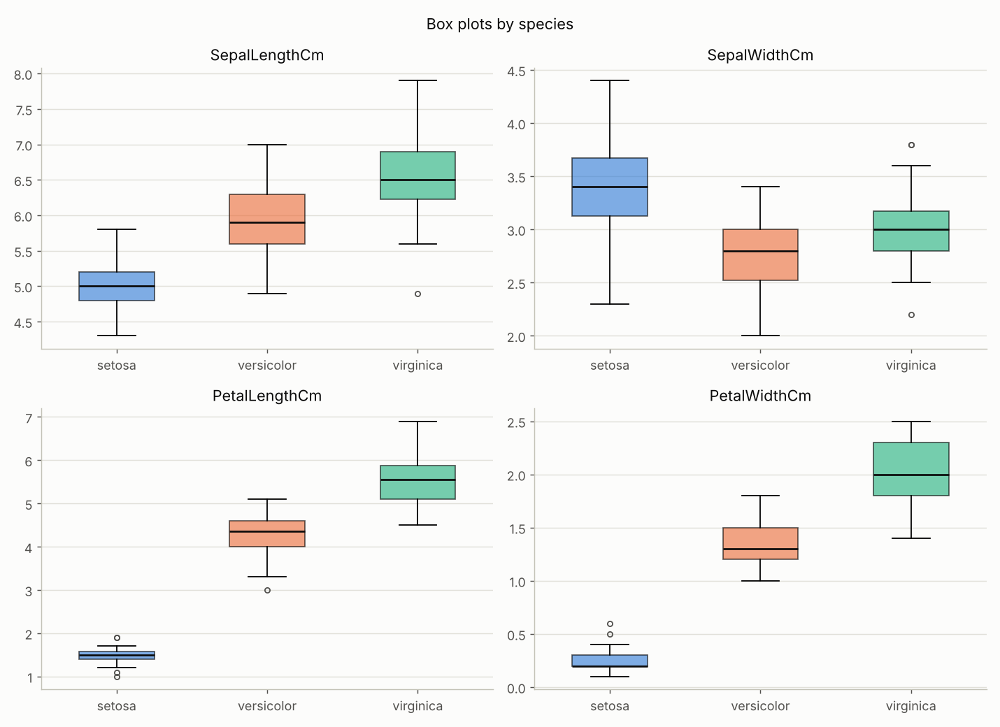
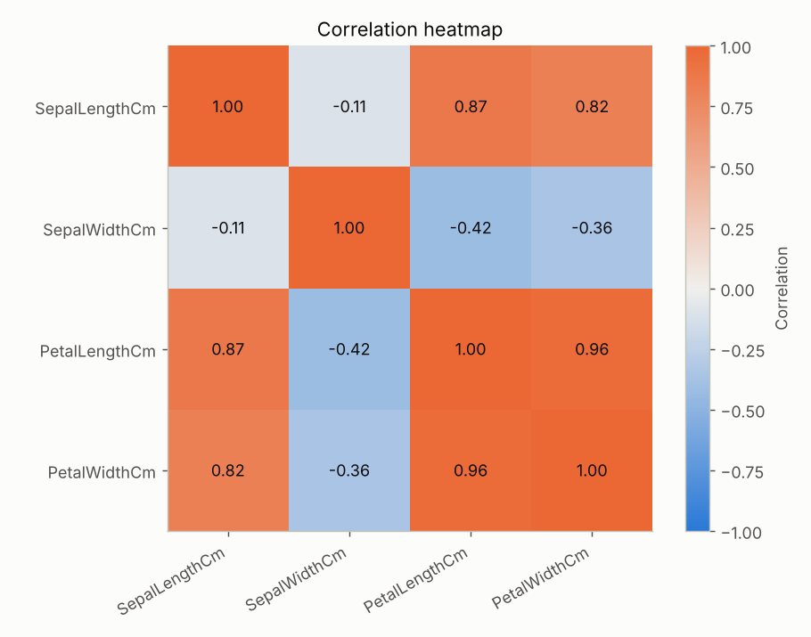

# Iris Dataset - Exploratory Data Analysis

Name: Famakinde Ireoluwa Zion
Matric NO.: 256620
Date: 08/10/2026

## About

This project is an exploratory data analysis of the Iris dataset, which has 150 flowers from three species (setosa, versicolor, virginica). Each flower has four measurements in cm: sepal length, sepal width, petal length and petal width.

I used pandas for the statistics and matplotlib for the plots.

## Files

- `iris_eda.py` - the analysis script
- `Iris.csv` - the dataset
- `images/` - the plots the script saves
- `requirements.txt` - packages needed

## Running it

```
pip install -r requirements.txt
python iris_eda.py
```

Keep `Iris.csv` in the same folder as the script. The statistics print in the terminal and the plots are saved to `images/`.

## What I looked at

- Shape of the data, missing values, duplicates and how many samples each species has
- Summary statistics, overall and for each species
- Correlation between the four measurements
- Outliers, using the IQR rule
- Plots: histograms, box plots, violin plots, a pair plot, a correlation heatmap, scatter plots and a species count

## Findings

- No missing values, and each species has 50 samples.
- Petal length and petal width separate the species best. Setosa does not overlap with the other two at all.
- Versicolor and virginica overlap a bit, mostly in the sepal measurements.
- Petal length and petal width are strongly correlated (0.96).
- Sepal width is weakly and negatively correlated with the other measurements.
- Only 4 outliers were found, all in sepal width.

## Plots




